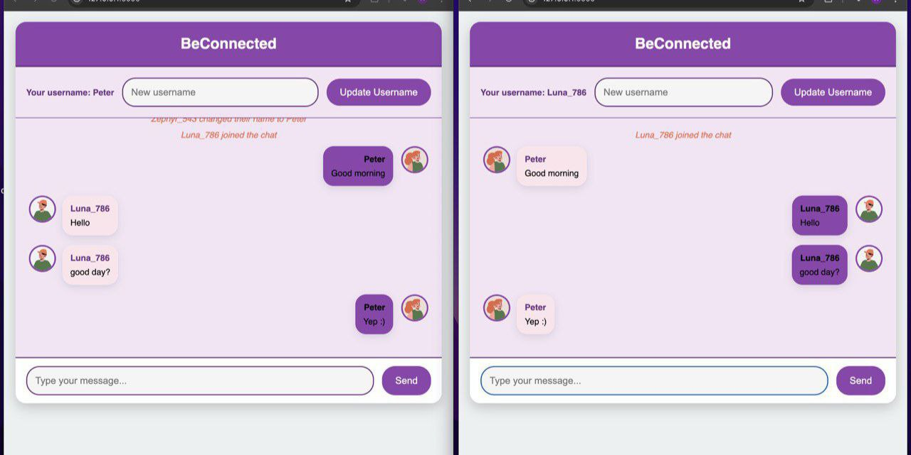

# BeConnected - Real-time Chat App

🚀 **Live Demo**: [BeConnected on Render](https://beconnected-6s37.onrender.com)

BeConnected is a real-time chat application built with Flask, Socket.io, and JavaScript. It allows users to send and receive messages instantly with a simple and clean UI.

## Features

- 🔗 **Real-time Messaging** with WebSockets
- 🎨 **Modern UI** with CSS styling
- 💬 **Username Customization**
- 🔥 **Flask & Socket.io Integration**
- ✅ **Deployed on Render**

---



## 🛠️ Setup Instructions

### 1. Clone the repository

```bash
git clone https://github.com/alikssant/beconnected.git
cd beconnected
```

### 2. Create a Virtual Environment

- **On macOS & Linux**:
  ```bash
  python3 -m venv venv
  ```
- **On Windows**:
  ```bash
  python -m venv venv
  ```

### 3. Activate the Virtual Environment

- **On macOS & Linux**:
  ```bash
  source venv/bin/activate
  ```
- **On Windows**:
  ```bash
  venv\Scripts\activate
  ```

### 4. Install Dependencies

- **On macOS & Linux**:
  ```bash
  pip3 install -r requirements.txt
  ```
- **On Windows**:
  ```bash
  pip install -r requirements.txt
  ```

### 5. Run the Application

- **On macOS & Linux**:
  ```bash
  python3 app.py
  ```
- **On Windows**:
  ```bash
  python app.py
  ```

## 📜 License

This project is open-source and available under the MIT License.
